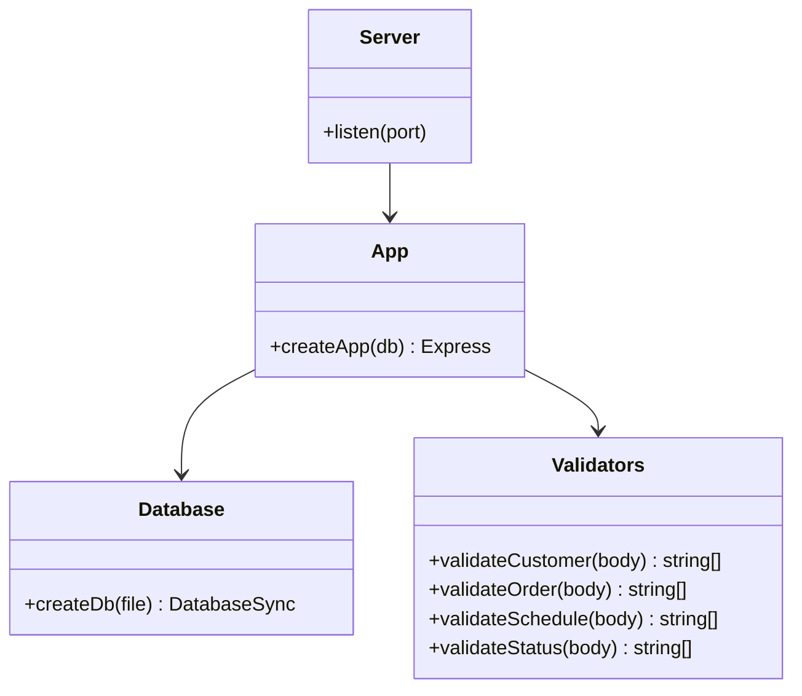

# Diagrama de clases

```mermaid
classDiagram
  class App {
    +createApp(db) Express
  }
  class Database {
    +createDb(file) DatabaseSync
  }
  class Validators {
    +validateCustomer(body) string[]
    +validateOrder(body) string[]
    +validateSchedule(body) string[]
    +validateStatus(body) string[]
  }
  class Server {
    +listen(port)
  }
  Server --> App
  App --> Database
  App --> Validators
```
