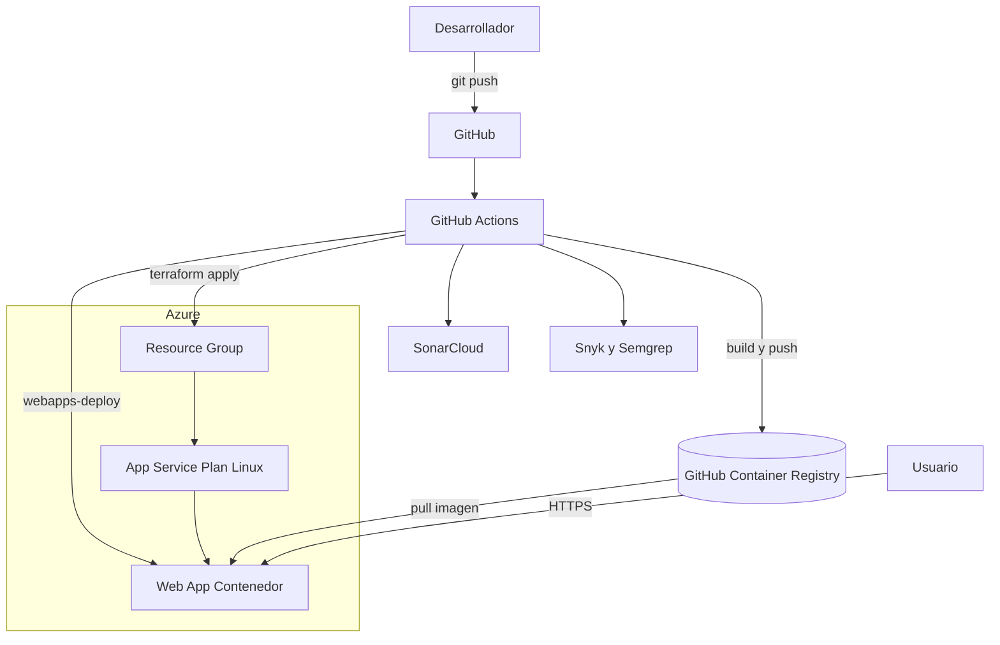

# Diagrama de despliegue

```mermaid
flowchart TB
  Dev[Desarrollador] -->|git push| GH[GitHub]
  GH --> CI[GitHub Actions]
  CI -->|build y push| GHCR[(GitHub Container Registry)]
  CI -->|terraform apply| RG
  CI -->|webapps-deploy| APP
  subgraph AZ[Azure]
    direction TB
    RG[Resource Group] --> PLAN[App Service Plan Linux]
    PLAN --> APP[Web App Contenedor]
  end
  GHCR -->|pull imagen| APP
  User[Usuario] -->|HTTPS| APP
  CI --> SONAR[SonarCloud]
  CI --> SNYK[Snyk y Semgrep]
```
