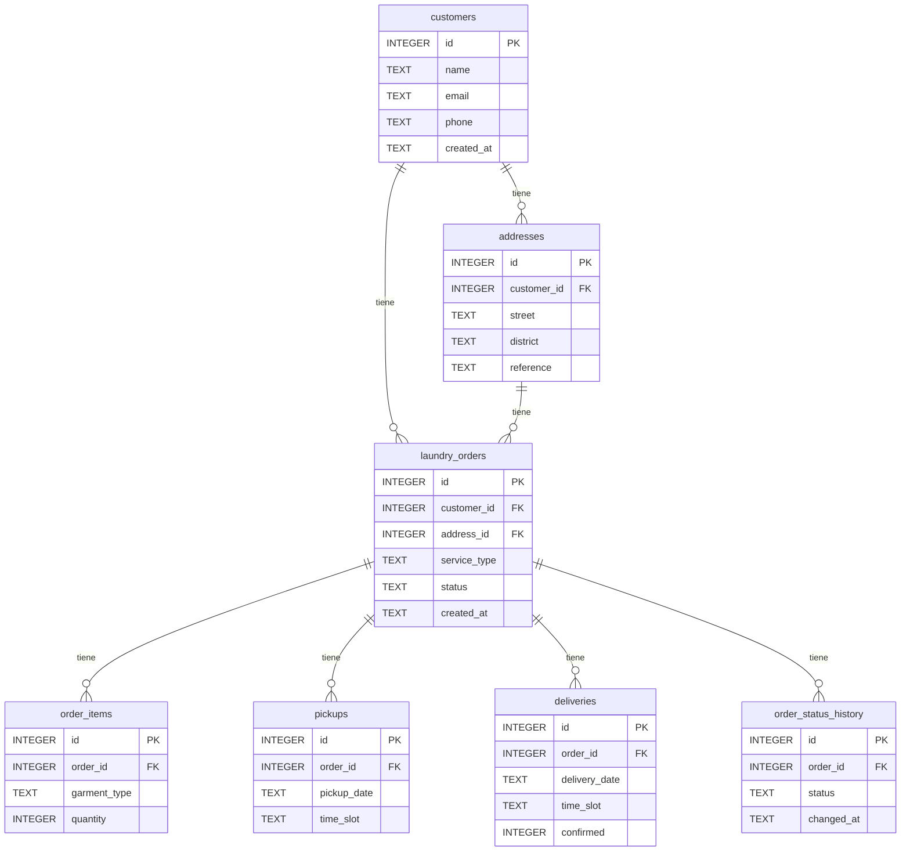

# Diagrama entidad-relación

```mermaid
erDiagram
  customers ||--o{ addresses : "tiene"
  customers ||--o{ laundry_orders : "tiene"
  addresses ||--o{ laundry_orders : "tiene"
  laundry_orders ||--o{ order_items : "tiene"
  laundry_orders ||--o{ pickups : "tiene"
  laundry_orders ||--o{ deliveries : "tiene"
  laundry_orders ||--o{ order_status_history : "tiene"
  customers {
    INTEGER id PK
    TEXT name
    TEXT email
    TEXT phone
    TEXT created_at
  }
  addresses {
    INTEGER id PK
    INTEGER customer_id FK
    TEXT street
    TEXT district
    TEXT reference
  }
  laundry_orders {
    INTEGER id PK
    INTEGER customer_id FK
    INTEGER address_id FK
    TEXT service_type
    TEXT status
    TEXT created_at
  }
  order_items {
    INTEGER id PK
    INTEGER order_id FK
    TEXT garment_type
    INTEGER quantity
  }
  pickups {
    INTEGER id PK
    INTEGER order_id FK
    TEXT pickup_date
    TEXT time_slot
  }
  deliveries {
    INTEGER id PK
    INTEGER order_id FK
    TEXT delivery_date
    TEXT time_slot
    INTEGER confirmed
  }
  order_status_history {
    INTEGER id PK
    INTEGER order_id FK
    TEXT status
    TEXT changed_at
  }
```
